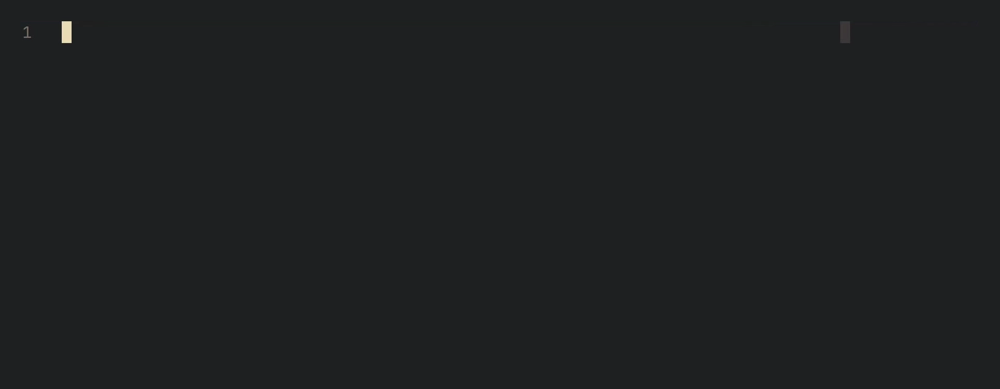

# blink-cmp-lorem

Simple dummy text generator for [blink.cmp](https://github.com/Saghen/blink.cmp) written in Lua.



## Installation

```lua
{
  "saghen/blink.cmp",
  version = "1.*",
  dependencies = {
    "lesbartosz/blink-cmp-lorem",
  },
  opts = {
    sources = {
      default = {
        ...
        "lorem",
      },
      providers = {
        lorem = {
          name = "Lorem",
          module = "lorem",
          score_offset = 100, -- Show at the top
          min_keyword_length = 5,
          opts = {
            classic_start = false, -- Start with "Lorem ipsum dolor sit amet..."
            variants = 1, -- How many random alternatives to show
            min_sentence_words = 3, -- Minimum amount of words in a sentence
            max_sentence_words = 15, -- Maximum amount of words in a sentence
            comma_per_words = 3, -- How many words between comma slots
            comma_chance = 0.6, -- Chance of a comma being inserted into a slot
            words = require("lorem.words"), -- List of template words
          },
        },
      },
    },
  },
}
```

## Usage

Type `Lorem` and then the amount of words to generate.
E.g. `Lorem50` will generate 50 words of dummy text.

## License

See [LICENSE](./LICENSE)
